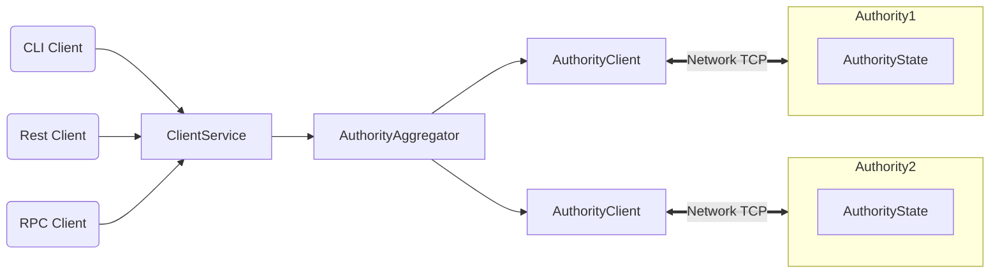

```mermaid
flowchart LR
    CC(CLI Client) --> ClientService
    RC(Rest Client) --> ClientService
    RPCC(RPC Client) --> ClientService
    ClientService --> AuthorityAggregator
    AuthorityAggregator --> AC1[AuthorityClient] & AC2[AuthorityClient]
    subgraph Authority1
      AS[AuthorityState]
    end
    subgraph Authority2
      AS2[AuthorityState]
    end
    AC1 <==>|Network TCP| Authority1
    AC2 <==>|Network TCP| Authority2
```